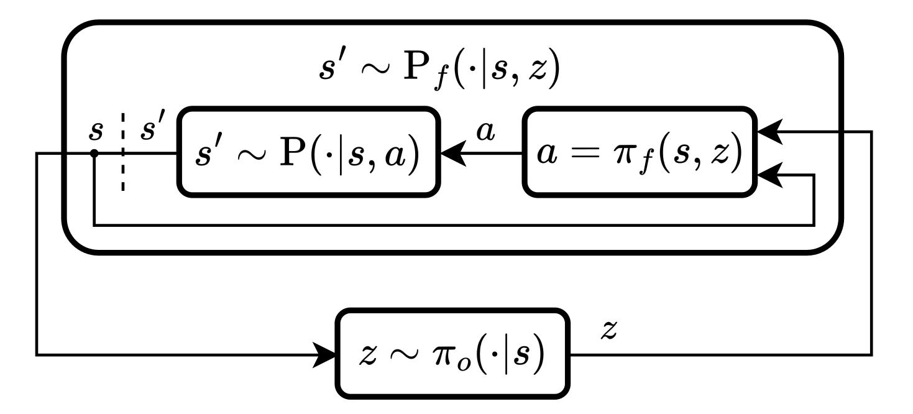

# Action Mapping for Reinforcement Learning in Continuous Environments with Constraints

### Official code for the paper:

**[Action Mapping for Reinforcement Learning in Continuous Environments with Constraints](https://openreview.net/forum?id=3oSauSj0Wk)**

by Mirco Theile, Lukas Dirnberger, Raphael Trumpp, Marco Caccamo, Alberto Sangiovanni-Vincentelli.

Accepted at **RLC 2025**.

## Action Mapping

**Action Mapping (AM)** is a modular framework for reinforcement learning in constrained continuous action spaces. It separates *feasibility* and *optimality* into two distinct learning phases:

1. **Feasibility Policy:**  
   A neural network that learns to generate all feasible actions for a given state in the environment. It forms a map from a latent space to the set of feasible actions.

2. **Objective Policy:**  
   A standard RL policy (e.g., SAC or PPO) that learns to select optimal actions *among* those deemed feasible by the feasibility policy.

This separation improves learning performance in environments with hard constraints.

The architecture is illustrated below:  



## Overview

This repository contains code to train and evaluate two configurations of the Action Mapping framework:

- **AM-SAC in a Path Planning Environment:**  
  Combines Action Mapping with Soft Actor-Critic in a spline-based path planning task subject to non-holonomic constraints.

- **AM-PPO in a Robotic Arm Environment:**  
  Combines Action Mapping with Proximal Policy Optimization in a robotic manipulation task with joint limits, joint velocity constraints, and obstacle avoidance.

## Installation
To install the required packages, run:
```bash
pip install -r requirements.txt
```
## Usage
### Training
When training an AM-SAC or AM-PPO agent, the trainer first trains the feasibility policy, which is a neural network that predicts whether a given action is feasible in the environment. After training the feasibility policy and then the objective policy. 
To avoid retraining of the feasibility policy, you can set the `--feas` option when starting the training. Provide the name of the log directory in the logs folder or use the example if you want to use the example feasibility policy. 
This will load the feasibility policy instead of training a new one again.

To train an AM-SAC agent in the path planning environment, run:
```bash
python train_pp.py config/path_planning_amsac.json
```
With the following options:
```
Usage: train_pp.py [OPTIONS] CONFIG

Options:
  --gpu
  --gpu_id TEXT         GPU ID to use. 0 by default.
  --generate            Generate a config file instead.
  -p, --params TEXT...  Overrides params in the config file. Provide
                        'path.to.param value'
  --id TEXT             Run ID for logging.
  --feas TEXT           If set load feasibility policy instead of training it.
  --verbose             Print network summary.
  --help                Show this message and exit.
```

To train an AM-PPO agent in the robotic arm environment, run:
```bash
python train_rob.py config/robot_arm_amppo.json
```
With the following options:
```
Usage: train_rob.py [OPTIONS] CONFIG

Options:
  --gpu
  --gpu_id TEXT         GPU ID to use. 0 by default.
  --generate            Generate a config file instead.
  -p, --params TEXT...  Overrides params in the config file. Provide
                        'path.to.param value'
  --id TEXT             Run ID for logging.
  --feas TEXT           If set load feasibility policy instead of training it.
  --verbose             Print network summary.
  --help                Show this message and exit.
```

### Graphical Evaluation

To visually evaluate the trained agents, two GUIs are provided. The first GUI is for the path planning environment, and the second GUI is for the robotic arm environment.
To load models for the GUIs, you need to provide the log id, e.g. `20250702_160357_path_planning_amsac`'
or the example id, e.g. `path_planning_amsac`. The script will search in the `logs` and `example` directories for the corresponding models.


To evaluate the provided example AM-SAC agent in the path planning environment, run:
```bash
python gui_pp.py path_planning_amsac
```
With the following options:
```
Usage: gui_pp.py [OPTIONS] MODEL

Options:
  --gpu
  --gpu_id TEXT         GPU ID to use. 0 by default.
  -p, --params TEXT...  Overrides params in the config file. Provide
                        'path.to.param value'
  -s INTEGER            Size of the window.
  --help                Show this message and exit.
```
In the path planning GUI, press `h` to print all options.

To evaluate the provided example AM-PPO agent in the robotic arm environment, run:
```bash
python gui_rob.py robot_arm_amppo
```
With the following options:
```
Usage: gui_rob.py [OPTIONS] MODEL

Options:
  --gpu
  --gpu_id TEXT         GPU ID to use. 0 by default.
  -p, --params TEXT...  Overrides params in the config file. Provide
                        'path.to.param value'
  --rand                Use random actions instead of the trained policy.
  --feas                Use feasible actions only.
  --stochastic          Use stochastic actions instead of deterministic.
  --verbose             Print network summary.
  --help                Show this message and exit.
```

## Citation
If you use this code in your research, please cite our paper:
```
@inproceedings{theile2025action,
    title={Action Mapping for Reinforcement Learning in Continuous Environments with Constraints},
    author={Mirco Theile and Lukas Dirnberger and Raphael Trumpp and Marco Caccamo and Alberto Sangiovanni-Vincentelli},
    booktitle={Reinforcement Learning Conference},
    year={2025}
}
```